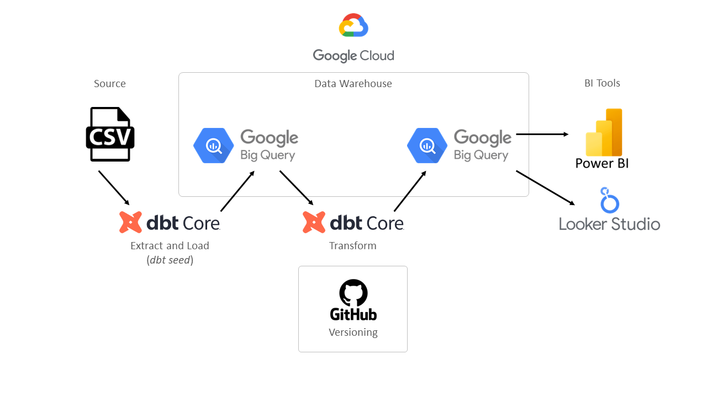

## ELT e Modelagem de dados com dbt

Projeto: Desenvolvimento de um Pipeline de ELT (Extract, Load and Transform) utilizando o dbt (data build tool).

O dbt (data build tool) é um framework Python, ferramenta de código aberto, usada para transformar e modelar dados. 
É projetado para ajudar equipes de dados a criar, manter e documentar pipelines de dados de maneira eficiente e colaborativa, trazendo boas práticas de engenharia de software para o mundo do big data.

## Etapas de Desenvolvimento

1. Instalação e Configuração Inicial
    - Instalação do dbt e suas dependências.
    - Configuração do arquivo `dbt_project.yml` para definir configurações do projeto, como nome, versão e diretórios.
    - Configuração do arquivo `profiles.yml` para definir a conexão com o data warehouse.

2. Ingestão de Dados
    - Utilização do comando `dbt seed` para criar as tabelas no schema 'erp' do Google Big Query, a partir de arquivos CSV.
   
3. Definição das Sources
    - Criação do arquivo `sources.yml` especificando as tabelas fontes que o dbt terá acesso.
    - Especificação dos testes que serão executados nas sources para garantir a qualidade dos dados.

4. Modelagem de dados nas Camadas Bronze, Silver e Gold
    - Criação dos modelos staging para cada tabela fonte na camada "bronze", selecionando e renomeando campos conforme necessário.
    - Criação dos modelos intermediate na camada "silver", para realizar joins entre tabelas e aplicar transformações mais complexas.
    - Criação dos modelos marts na camada "gold", fazendo referência aos modelos intermediate para criar as estruturas analíticas finais.

5. Documentação e Testes
    - Criação de arquivos `.yml` nas camadas "silver" e "gold" para documentar os modelos de dados criados, bem como definição de testes para verificar a integridade dos dados transformados e a qualidade dos resultados.

6. Boas Práticas e Versionamento
    - Execução das boas práticas de engenharia de software como: testes, documentação e versionamento de código.
    - Colocando em prática um estilo de código consistente (code style).

## Protótipo do Pipeline

## Passo a Passo

Após instalar o dbt e suas dependências e configurar os arquivos `dbt_project.yml` e `profiles.yml`, dei início ao projeto realizando a ingestão dos dados em formato CSV por meio do comando `dbt seed`, isso resultou na criação das tabelas no esquema "erp" dentro do Google BigQuery.

Em seguida, criei o arquivo `sources.yml`, no qual especifiquei as tabelas fontes que o dbt teria acesso, além de definir os testes que seriam executados nessas fontes para assegurar a integridade dos dados.

Optei então por estruturar o modelo de dados em três camadas: bronze, silver e gold, comecei criando os modelos de staging na camada "bronze", onde selecionei e renomeei colunas conforme necessário. 
Na sequência, desenvolvi os modelos intermediate na camada "silver", realizando junções entre tabelas e aplicando transformações mais complexas.
Por fim, desenvolvi os modelos marts na camada "gold", realizei alguns ajustes para atender às necessidades da área de negócio, incluindo cálculos e agregações.

Com o intuito de garantir a clareza e documentação de todo o processo, criei arquivos `.yml` nas camadas intermediate e marts, detalhando a finalidade e os campos resultantes dos modelos de dados criados.

Ao longo de todo o desenvolvimento, aderi a boas práticas de engenharia de software, incluindo a realização de testes rigorosos, documentação abrangente e o uso de um estilo de código coerente.
O processo foi guiado por princípios de versionamento de código e seguiu as diretrizes de qualidade e eficiência.

## Geração de Valor para o Negócio

#### Qualidade dos Dados:
Ao aplicar transformações, limpeza e validações nos dados de entrada, o projeto assegura que os dados usados nas análises estejam corretos e confiáveis, reduzindo erros e garantindo tomadas de decisão mais precisas.

#### Eficiência Operacional:
A estrutura de camadas do dbt (bronze, silver, gold) facilita a preparação dos dados para análise, os modelos intermediários e marts permitem que os analistas tenham acesso a dados prontos para uso, agilizando o processo de análise e permitindo insights mais rápidos.

#### Consistência e Padronização:
A utilização de boas práticas de engenharia de software e modelagem de dados garante que as transformações e cálculos sejam aplicados de forma consistente em todo o projeto, isso ajuda a evitar discrepâncias e ambiguidades nos resultados analíticos.

#### Facilidade de Manutenção:
A estrutura modular do dbt facilita a manutenção contínua do projeto, se houver alterações nos requisitos de análise ou nos dados fonte, as mudanças podem ser aplicadas em camadas específicas sem afetar todo o pipeline.

#### Escalabilidade:
Com o dbt, é possível lidar com volumes crescentes de dados, permitindo que o projeto se expanda à medida que a organização cresce e suas necessidades analíticas aumentam.

## Sobre o Desenvolvedor

Lucas Ramalho atua como Analytics Engineer e Sr. BI Developer, é formado em Big Data e Inteligência Competitiva pela Descomplica Faculdade Digital, atua com dados desde 2021, já atuou em diferentes segmentos como Varejo, Logística, Indústria e Tecnologia.
 
Hoje, atua no Grupo BBM um dos principais operadores logísticos do Mercosul, entregando soluções em dados para apoiar a tomada de decisão de toda a companhia. Sua rotina consiste em trabalhar para Projetar, Desenvolver, Implementar e Manter Soluções em dados, bem como Desenvolver Pipelines de ETL/ELT, sempre optando pela Otimização de Desempenho e Escalabilidade.

Conheça mais detalhes no [LinkedIn](https://www.linkedin.com/in/olucasramalho/).

Fique a vontade para se conectar nas redes sociais:

 
  
  
  

